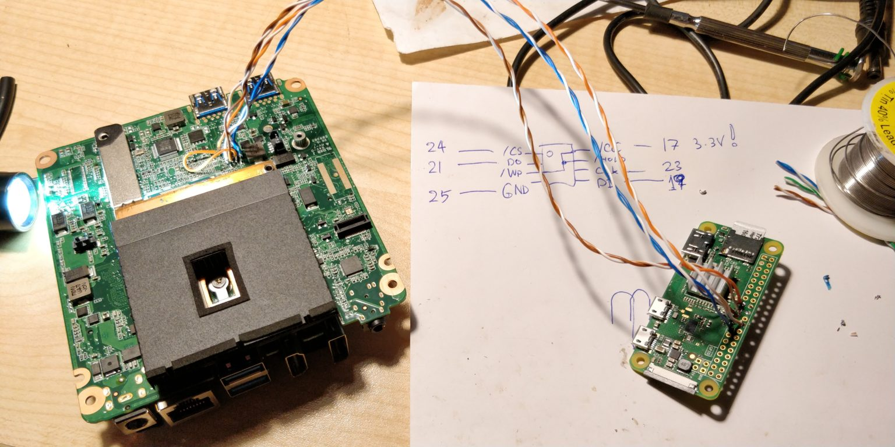

# Asus Chromebox cn60
I inherited an [Asus Chromebox cn60](https://www.asus.com/gr/Chrome-Devices/Chromebox/ProductPrint/) recently that was locked to a google enterprise enrollment for a company that no longer exists.
It's the version with a haswell i7-4600U CPU, 4GB RAM, and a 16GB SSD. 
It's not a particularly expensive machine these days, but since the RAM and SSD are both easily upgradeable, I figured it could be worth using as a low power linux server.

## Chrome OS Google Enterprise Enrollment
This device was "enterprise enrolled" to a company that no longer existed. [Enterprise entrollment](https://chromium.googlesource.com/chromium/src/+/master/docs/enterprise/enrollment.md) allows an organization to manage chromeboxes from a central google "organization" account.
This means that when I booted the cn60 I was met with a chrome OS login screen that wanted me to login with a google account. 

To make it extra spicy, the BIOS is actually locked, so just installing a new OS via USB is non-trivial.

Luckily, there's a very active community around chrome OS devices, and one person in particular ([Mr Chromebox](https://mrchromebox.tech/)) has put in an incredible amount of work providing open source BIOS/UEFI firmwares.

These two links were *very* helpful:
- https://wiki.mrchromebox.tech/Unbricking
- https://sergei.nz/unbricking-asus-chromebox-cn60/

First step is to open the box and find the SPI chip. 
The one in the i7 cn60 is a [Winbond 25Q64FVSIG](https://www.datasheetq.com/datasheet-download/840460/1/Winbond/25Q64FVSIG).
Unfortunately it's on the bottom of the board.

Opening the case isn't too difficult: there are four phillips screws on the bottom and then you can either try to pry the sides up or actually use two case screws in the two center (I think mounting??) holes which allows you to pretty easily pull the back off.
This will provide you access to RAM, SSD, and wifi modules. In order to replace the SSD, you'll need to take the wifi chip off, but it's pretty straightforwards.

Getting to the back of the board is a little trickier. You'll need to disconnect the cables to the wifi and [FILL IN MORE BOARD INFO HERE]

On the back of the board, the SPI chip is underneath the fan, so that will need to come off [MORE REMOVING FAN INFO HERE W/ PICS!!!]

Ok yay, now the fan is off and we have direct access to the SPI chip 🎊️

I used a CH341a USB flash programmer as recommended by mrchromebox. Because the SPI chip is 3v, the only thing we need is the programmer and the chip clip. 

The chip clip is this very handy tool which lets us easily connect to each pin of the chip without any terrifying soldering. This is super handy for boards that don't just provide you with easy jumper pins access.

*This person was brave enough and had a steady enough hand to solder directly onto the pins of the chip on the board. I am neither :D*
Pic from https://sergei.nz/unbricking-asus-chromebox-cn60/

The SPI chip has a teensy dot on it where pin #1 goes. The CH341a also has a convenient little dot to mark pin #1 as well as a marking on the wire. [PICS HERE!!]
